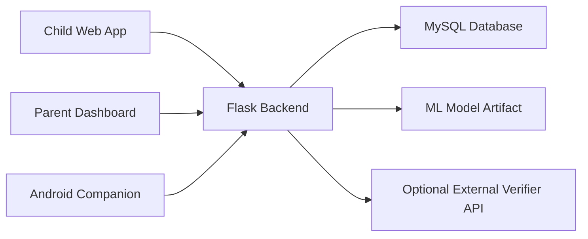

# Cyber Mzazi Project Documentation

## 1. Overview

Cyber Mzazi is a family safety platform built to help families review and classify risky incoming digital messages in a transparent, consent-based way. The system is centered on a Flask backend, a MySQL database, a supervised machine-learning classifier, a parent web dashboard, a child-facing safety app, and an Android notification companion flow.

The project is intentionally scoped around privacy-respecting safety workflows:

- incoming third-party messages can be reported manually from the child interface
- approved integrations can submit messages through the API
- Android devices can forward message notifications when the family explicitly enables notification access
- parents can review results, see logs, manage children, and approve child sign-out requests inside the app

The system does not implement covert spyware behavior, hidden device persistence, or forced access to private accounts.

## 2. Main Goals

Cyber Mzazi is designed to:

- classify risky incoming messages using a trained ML pipeline
- support parent review and human-in-the-loop correction
- maintain an auditable activity history
- separate parent and child experiences clearly
- support English and Swahili interfaces
- allow multi-child family management
- support online deployment through GitHub and Render
- provide an Android-ready pathway for notification-based ingestion

## 3. Technology Stack

### Backend

- Python
- Flask
- Flask-Login
- Flask-SQLAlchemy
- Flask-CORS

### Database

- MySQL
- SQLAlchemy ORM
- Managed MySQL support, including Aiven

### Machine Learning

- pandas
- scikit-learn
- joblib
- `LinearRegression`
- `RandomForestClassifier`

### Deployment

- Git
- GitHub
- Render
- Gunicorn

### Android Companion

- Kotlin
- Android NotificationListenerService
- Android SDK command-line tools
- VS Code command-line workflow

## 4. Repository Structure

```text
app.py
config.py
dataset.csv
PROJECT_DOCUMENTATION.md
README.md
FRONTEND_API.md
ANDROID_COMPANION.md
ml/
scripts/
webapp/
android-companion/
database/
artifacts/
```

Important files:

- [app.py](app.py)
- [config.py](config.py)
- [ml/train.py](ml/train.py)
- [webapp/__init__.py](webapp/__init__.py)
- [webapp/models.py](webapp/models.py)
- [webapp/api.py](webapp/api.py)
- [webapp/auth.py](webapp/auth.py)
- [webapp/parent.py](webapp/parent.py)
- [webapp/child.py](webapp/child.py)
- [scripts/bootstrap.py](scripts/bootstrap.py)
- [scripts/init_db.py](scripts/init_db.py)
- [android-companion](android-companion)

## 5. High-Level Architecture



### Architecture summary

- The Flask app is the central application server.
- The MySQL database stores users, families, messages, logs, approvals, language preferences, documents, and Android device links.
- The ML artifact is loaded by the backend for classification.
- The parent and child interfaces are server-rendered HTML pages.
- The API mirrors the same behavior for future frontend or mobile use.
- The Android companion sends notification payloads into a secure backend ingestion endpoint.

## 6. Backend Application Design

### Application creation

The application starts in:

- [app.py](app.py)

This file loads environment variables and creates the Flask app through:

- [webapp/__init__.py](webapp/__init__.py)

### Registered modules

The backend is split into blueprints:

- `auth`
- `parent`
- `child`
- `api`

These correspond to:

- authentication flows
- parent HTML pages
- child HTML pages
- JSON API endpoints

### Configuration

The main configuration is in:

- [config.py](config.py)

Important configuration areas:

- `DATABASE_URL`
- `SECRET_KEY`
- `FRONTEND_ORIGIN`
- secure cookie settings
- model artifact and metrics paths
- dataset path
- MySQL SSL certificate support
- optional external verifier configuration

## 7. Data Model

The core schema is defined in:

- [webapp/models.py](webapp/models.py)

### Main entities

#### Family

Represents a family account and groups together:

- parent and child users
- message records
- activity logs
- logout requests
- safety resource documents
- Android notification devices

#### User

Represents both parents and children.

Fields include:

- `role`
- `name`
- `email`
- `phone`
- `username`
- hashed password
- preferred language
- child logout approval requirement

#### MessageRecord

Stores each analyzed message or notification.

Fields include:

- `source_platform`
- `source_app_package`
- `sender_handle`
- `browser_origin`
- `notification_title`
- `message_text`
- `capture_method`
- `predicted_label`
- `predicted_confidence`
- `risk_indicators`
- verification results
- reviewed label

Possible capture methods currently include:

- `manual_report`
- `android_notification`

#### ActivityLog

Stores audit entries for major user and system actions.

Examples:

- registration
- login
- logout
- message submission
- review
- language change
- logout request
- logout approval
- child added
- Android link created
- Android link disabled
- Android notification ingested

#### LogoutRequest

Stores child sign-out approval requests.

Fields include:

- child user
- status
- action type
- action description
- request note
- approver
- timestamps

#### SafetyResourceDocument

Stores uploaded safety documents for parents to manage.

#### NotificationIngestionDevice

Represents an Android notification device linked to a selected child.

Fields include:

- device name
- child user
- platform
- permission scope
- token hash
- status
- last seen time
- last ingested time
- last notification app

## 8. Authentication and Access Control

The authentication logic is defined in:

- [webapp/auth.py](webapp/auth.py)

### Parent login

Parent authentication uses:

- email or phone as identifier
- password

Parent login page:

- [webapp/templates/parent_login.html](webapp/templates/parent_login.html)

### Child login

Child authentication uses:

- parent contact
- child username
- child password

Child login page:

- [webapp/templates/child_login.html](webapp/templates/child_login.html)

### Registration

Family registration creates:

- one family record
- one parent user
- one child user

Additional children can later be created through the Family Hub.

### Role protection

Parent routes require a parent session.

Child routes require a child session.

API routes also enforce the same role checks.

## 9. Parent Interface

The parent interface logic is primarily in:

- [webapp/parent.py](webapp/parent.py)
- [webapp/templates/parent_page.html](webapp/templates/parent_page.html)

### Parent pages

Primary pages:

- Alerts
- Dashboard
- Child Profile
- Activity Log
- Alert Settings

Support pages:

- Family Hub
- Safety Resources
- Help & Support
- Privacy Center
- System Status

Advanced pages:

- Insights
- Language Settings
- Notification Log
- Trusted Contacts

### Parent capabilities

Parents can:

- switch the selected child
- review message classification results
- approve child sign-out requests
- see approval history
- view logs for the selected child
- add more child profiles
- upload and download safety documents
- create Android notification links
- disable Android notification links
- switch the interface language between English and Swahili

## 10. Child Interface

The child interface logic is primarily in:

- [webapp/child.py](webapp/child.py)
- [webapp/templates/child_page.html](webapp/templates/child_page.html)

### Child pages

- Home
- My Safety
- Talk
- Help
- Settings
- Safety Check

### Child capabilities

Children can:

- report incoming third-party messages manually
- see recent safety checks
- request sign-out for the current child session on the current device
- change language
- see when a parent has approved the sign-out request

The child app uses supportive language and avoids surveillance-heavy framing.

## 11. Message Classification Pipeline

Training logic:

- [ml/train.py](ml/train.py)

Runtime classifier:

- [webapp/services/ml_service.py](webapp/services/ml_service.py)

### Training flow

The training pipeline:

1. loads `dataset.csv`
2. prepares text features
3. vectorizes text
4. reduces feature dimensionality
5. trains a `LinearRegression`-based scorer
6. trains a `RandomForestClassifier`
7. blends outputs
8. saves the artifact and metrics

### Runtime prediction flow

When a message is submitted:

1. the classifier is loaded
2. the text is transformed using the saved vectorizer and SVD
3. both models score the text
4. the system blends the result
5. a final label and confidence are returned
6. risk indicators are attached

### Human-in-the-loop retraining

Parents can review and relabel messages.

Those reviewed labels are included during later retraining, which improves the dataset gradually without allowing unrestricted autonomous learning.

## 12. Verification Layer

Verification logic:

- [webapp/services/verification.py](webapp/services/verification.py)

Two modes are supported:

- external verification via a configured verifier API
- fallback heuristic checks when no external verifier is configured

This gives Cyber Mzazi a second stage of confirmation after the ML prediction.

## 13. Logout Approval Workflow

The child sign-out approval flow is one of the core safety controls.

### Child request

The child requests sign-out for:

- the current child session
- on the current child device

This does not log the whole device out of Android. It only ends the child session inside Cyber Mzazi.

### Parent approval

The parent sees the request in:

- sidebar footer
- Alerts
- Child Profile
- Notification Log

The parent can then approve it.

### Child completion

Once approved:

- the child sees that approval
- the child can sign out once

This approval is consumed after use.

## 14. Multi-Child Support

Multi-child support is handled through:

- [webapp/services/family_context.py](webapp/services/family_context.py)

The parent can:

- add more children
- select which child is currently active
- view child-specific logs, alerts, and approval history

The selected child determines which data appears on parent pages.

## 15. Language Support

Language support is defined in:

- [webapp/ui_text.py](webapp/ui_text.py)

Currently supported languages:

- English
- Kiswahili

Language preference is stored per user in the database and is also reflected in session state for rendering.

## 16. REST API

The API is defined in:

- [webapp/api.py](webapp/api.py)

Related guide:

- [FRONTEND_API.md](FRONTEND_API.md)

### API categories

- health
- authentication
- parent page data
- child page data
- message submission
- message review
- logout request and approval
- child selection
- child creation
- language updates
- safety document upload
- Android device link creation
- Android link disable
- Android notification ingestion

### Important endpoints

- `GET /api/health`
- `POST /api/auth/register`
- `POST /api/auth/login`
- `POST /api/auth/logout`
- `GET /api/parent/dashboard`
- `GET /api/child/dashboard`
- `POST /api/child/messages`
- `POST /api/parent/messages/<id>/review`
- `POST /api/child/logout-request`
- `POST /api/parent/logout-requests/<id>/approve`
- `POST /api/parent/family-hub/children`
- `POST /api/parent/android-devices`
- `POST /api/parent/android-devices/<id>/disable`
- `POST /api/device-ingest/android-notifications`

## 17. Android Notification Ingestion

The Android ingestion backend support is implemented through:

- [webapp/services/notification_devices.py](webapp/services/notification_devices.py)
- [webapp/api.py](webapp/api.py)
- [webapp/parent.py](webapp/parent.py)

### Flow

1. Parent creates an Android notification link for a selected child.
2. A secure one-time token is generated.
3. The token is stored only as a hash in the database.
4. The Android app receives the token through QR or manual entry.
5. The Android app forwards notification payloads to:
   - `POST /api/device-ingest/android-notifications`
6. The backend authenticates the token.
7. The backend classifies the notification text.
8. The backend stores the result as a `MessageRecord`.

### Stored Android metadata

- app package
- notification title
- capture method
- device activity timestamps

## 18. Android Companion App

Android companion files:

- [android-companion](android-companion)
- [ANDROID_COMPANION.md](ANDROID_COMPANION.md)

### Purpose

The Android companion allows a real Android device to:

- pair with the backend
- receive notification listener permission
- capture supported notification text
- apply per-app allow and block filters
- queue failed uploads when offline
- retry later
- display a small in-app recent-capture log

### Current Android features

- manual test payload
- notification listener capture
- QR pairing
- URL/token storage
- package allow/block lists
- offline queue
- retry queued uploads
- recent notification log
- command-line build and install workflow without Android Studio

### Development workflow

The project now supports:

- VS Code
- Android SDK command-line tools
- command-line build scripts
- `adb` installation

## 19. Setup and Local Development

### Python backend setup

1. create a virtual environment
2. install dependencies
3. configure `.env`
4. initialize the database
5. train the model
6. run the app

Use the shorter operational instructions in:

- [README.md](README.md)

### Android companion setup

Use:

- [ANDROID_COMPANION.md](ANDROID_COMPANION.md)
- [android-companion/tools/setup-android-sdk.md](android-companion/tools/setup-android-sdk.md)

## 20. Deployment

### Render

Deployment files:

- [render.yaml](render.yaml)
- [Procfile](Procfile)
- [wsgi.py](wsgi.py)

Startup command:

```text
python scripts/bootstrap.py && gunicorn --bind 0.0.0.0:$PORT wsgi:app
```

### Bootstrap behavior

The bootstrap process:

- ensures the runtime schema exists
- applies certain schema upgrades automatically
- skips model retraining when the artifact already exists
- retrains only when needed or forced

### Database SSL

The project supports MySQL SSL paths for providers such as Aiven.

## 21. Runtime Schema Upgrades

Runtime schema handling:

- [webapp/services/schema.py](webapp/services/schema.py)

This helper allows safer deployment evolution by:

- creating missing tables
- adding new columns when needed
- updating default values for older rows

## 22. Security and Privacy Notes

Cyber Mzazi is designed around consent-based safety checks.

### Supported

- manual reporting
- family-managed sign-out approval
- reviewed-label retraining
- token-protected Android notification ingestion
- audit logs

### Not supported

- covert spyware
- hidden surveillance
- forced access to private social-media accounts
- automatic scraping of all app data
- automatic iPhone cross-app reading

### Why this matters

This keeps the system more realistic, legally safer, and closer to platform policies.

## 23. Known Limitations

- the ML model accuracy shown during training may overstate real-world performance
- Android automatic capture depends on notification visibility
- iOS-style cross-app message reading is not supported
- the Android companion currently focuses on notification ingestion rather than full device management
- QR pairing currently relies on a generated QR image URL in the parent web view

## 24. Suggested Future Improvements

- signed Android release build pipeline
- WorkManager-based background retries
- richer parent notification settings
- stronger document categorization
- local QR generation instead of remote image rendering
- per-app risk sensitivity
- richer analytics dashboards
- more structured export features

## 25. Conclusion

Cyber Mzazi currently stands as a full-stack family safety MVP with:

- a Flask web platform
- MySQL persistence
- an ML classifier
- separate parent and child interfaces
- multilingual support
- multi-child support
- parent-controlled child sign-out
- safety resource management
- Android notification ingestion support
- an Android companion workflow that can be used with a real Android device

It is both a deployable application and a foundation for future mobile and frontend expansion.
